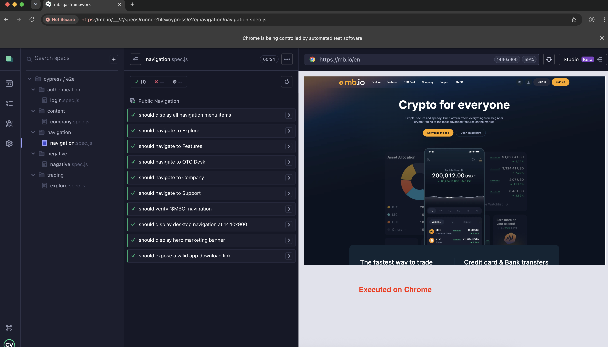
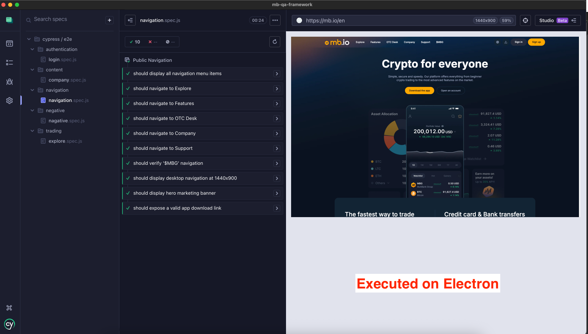

# MultiBank UI Automation Framework


Scalable UI automation framework built using **Cypress** for the **MultiBank QA Automation Assessment**.

The framework validates core user journeys of the MultiBank marketing platform while demonstrating clean architecture, maintainability, and industry best practices.

---

## Tech Stack

- Cypress 15
- JavaScript
- Node.js
- Page Object Model (POM)
- GitHub Actions
- Mochawesome Reporting

---

## Framework Highlights

- Page Object Model (POM) architecture
- Reusable page components and utilities
- Environment-based configuration
- Independent and deterministic test cases
- Cross-browser execution support (Chrome, Microsoft Edge, Firefox)
- Negative and edge-case validation
- HTML & JSON execution reports
- GitHub Actions CI integration
- Easy to maintain and extend

---

## Project Structure

```text
multibank-ui-automation-framework
│
├── .github
│   └── workflows
│       └── cypress.yml
│
├── cypress
│   ├── e2e
│   │   ├── authentication
│   │   ├── navigation
│   │   ├── trading
│   │   ├── content
│   │   └── negative
│   │
│   ├── pages
│   ├── fixtures
│   ├── support
│   └── downloads
│
├── docs-task2
|   ├── images
│   ├── Task-2-QA-Strategy.md
│   ├── Test-Plan.md
│   ├── Release-Readiness-Checklist.md
│   └── Risk-Matrix.md
|
├── reports
│   ├── html
│   └── json
│
├── cypress.config.js
├── package.json
├── README.md
└── .gitignore
```

---

## Test Coverage

### 1. Navigation & Layout

- Verify top navigation renders correctly
- Verify navigation links redirect to expected destinations
- Verify desktop navigation layout

### 2. Trading Functionality

- Verify Spot Market section
- Verify trading pair categories
- Verify trading pair data structure
- Verify navigation to trading pair detail pages

### 3. Content & Links

- Verify marketing banner
- Verify App Store download link
- Verify Company page hero section
- Verify statistics section
- Verify trust features
- Verify community section

### 4. Negative & Edge Cases

- Invalid route handling
- Broken navigation link detection
- Mobile viewport validation

---

## Prerequisites

- Node.js 18+
- npm

---

## Installation

Clone the repository:

```bash
git clone https://github.com/vipkum2/multibank-ui-automation-framework.git
```

Navigate to the project:

```bash
cd multibank-ui-automation-framework
```

Install dependencies:

```bash
npm install
```

---

## Running Tests

Run the complete automation suite with a single command:

```bash
npm test
```
This command executes the full regression suite and generates Mochawesome HTML and JSON reports.

Open Cypress Test Runner:

```bash
npm run cy:open
```

Execute individual test suites:

```bash
npm run test:smoke
npm run test:navigation
npm run test:trading
npm run test:content
npm run test:negative
```

---

## Cross-Browser Execution

Run the framework on Chrome:

```bash
npm run test:chrome
```

Run the framework on Microsoft Edge:

```bash
npm run test:edge
```

Run the framework on Firefox:

```bash
npm run test:firefox
```

---

## Cross-Browser Execution Evidence

The framework supports execution across multiple browsers. Sample successful executions are shown below.

| Browser  | Status    |
| -------- | --------- |
| Chrome   | ✅ Passed |
| Electron | ✅ Passed |

### Chrome



### Electron



---

## Test Reports

The framework generates Mochawesome HTML and JSON reports automatically after execution.

Report structure:

```text
reports/
├── html/
└── json/
```

A sample Mochawesome HTML report is included in the repository:

```text
reports/html/index.html
```

---

## Continuous Integration

A GitHub Actions workflow is included to automate test execution.

### Workflow Triggers

- Push to the `main` branch
- Pull requests targeting the `main` branch
- Manual execution using **Run workflow**

Workflow location:

```text
.github/workflows/cypress.yml
```

The workflow automatically:

- Checks out the repository
- Sets up the Node.js environment
- Installs project dependencies
- Executes the complete Cypress test suite
- Uploads the Mochawesome execution report as a workflow artifact

Sample successful workflow executions are available under the repository's **Actions** tab.

---

## Framework Design Decisions

- Implemented using the Page Object Model to separate UI interaction from test logic.
- Reusable page methods and centralized selectors improve maintainability.
- Tests are independent and deterministic to support reliable execution.
- Assertions focus on business functionality rather than implementation details.
- Test suites are organized by functional area to simplify maintenance and future expansion.

---

## Assumptions

- The URL (`https://trade.mb.io`) provided in assignement redirected to the login page, I made a smoke test for it to redirect (`https://mb.io/`) via clicking on logo icon.
- Remainng test is directly test with `https://mb.io/`. As For this product I do not want to use cross origin for all specs.
- Trading data is validated on the Explore page.
- External application store links(like click on $MBG redirect to `token.multibankgroup.com`) are validated for successful navigation.
- Why MultiBank is located via Company navigation → /company
- Test execution does not require authenticated trading functionality.
- The public marketing website may intermittently generate known React client-side exceptions. These are treated as known application issues and are filtered to avoid false test failures.

---

## Future Enhancements

- API/network response validation
- Visual regression testing
- Accessibility testing
- Test data externalization
- Parallel execution
- Docker-based test execution

---

## Additional Documentation : Task 2

The repository also includes supporting QA documentation for **Task 2** under the `docs-task2/` directory.

| Document                           | Description                                                     |
| ---------------------------------- | --------------------------------------------------------------- |
| `Task-2-QA-Strategy.md`          | Written responses covering the QA strategy and testing approach |
| `Test-Plan.md`                   | Overall testing scope, objectives, and execution strategy       |
| `Release-Readiness-Checklist.md` | Checklist used to assess release readiness                      |
| `Risk-Matrix.md`                 | Risk assessment with probability, impact, and mitigation        |

---

## Author

**Vipin Kumar**

I used AI assistance for brainstorming, code review, and documentation. All implementation decisions, validation, and final review were performed by me.
